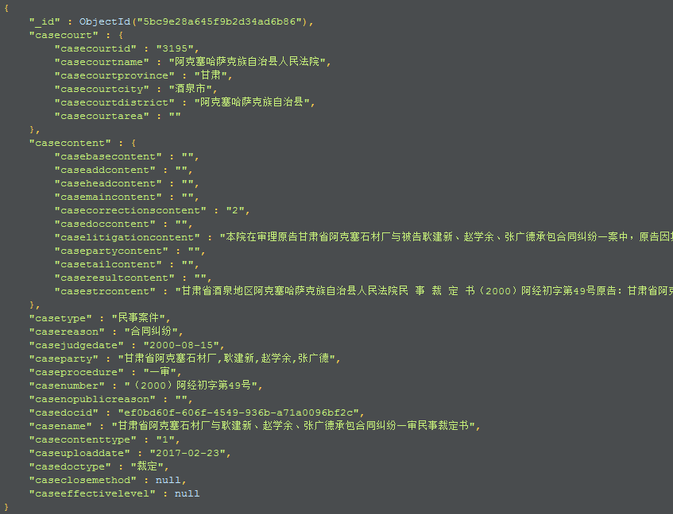
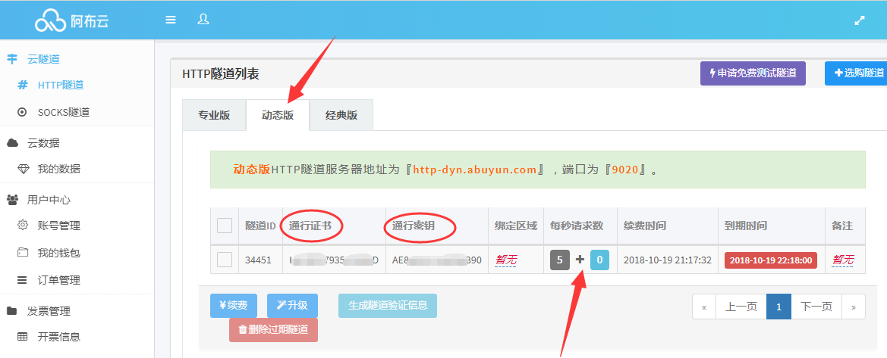
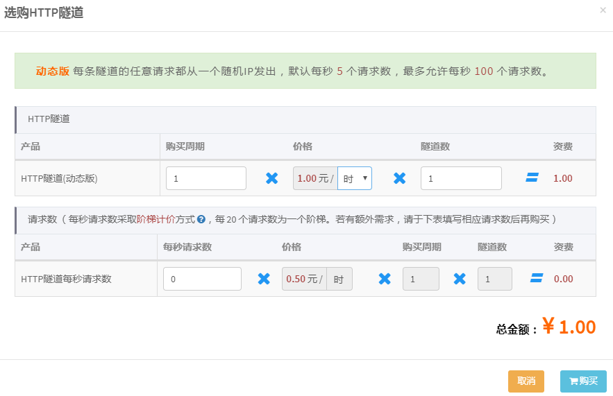

Scrapy框架爬取中国裁判文书网案件数据 
===========================
     
### 中国裁判文书网 - http://wenshu.court.gov.cn/
|Author|:sunglasses:Henryhaohao:sunglasses:|
|---|---
|Email|:hearts:1073064953@qq.com:hearts:

      
****
## :dolphin:声明
### 抱歉，代码仅用于学习交流！！所以在此我并没有公开部分参数的JS解密文件。感谢大家！  
### 因为我不想被请 drink tea 啊~~:coffee:大家懂得哈！:eyes:
## :dolphin:介绍
### 该项目为Scrapy框架爬取[中国裁判文书网](http://wenshu.court.gov.cn/)案件数据（2018-10-20最新版）
- 项目文件: Wenshu_Project
- 运行须知: 
> **数据库配置** : 运行前根据自己需要修改settings.py中的MongoDB数据库的配置<br>

> **反爬问题** : 由于文书网的反爬监控很严格（一级验证码,二级验证码,JavaScript反爬,IP检测...）,所有采用[阿布云动态隧道代理](https://www.abuyun.com/)方案,每一次request请求都是不同的IP,这样就不会触发反爬检测了~:sunglasses:。还是挺好用的,基本上每个IP都可以用,主要也还方便,直接用它的代理服务器发出请求,不用像一般的代理IP那样还需要取出IP,再代入IP进行请求。代理相关配置在middlewares.py的类ProxyMiddleware中。<br>

> **爬取策略问题** : 现在的文书网总量已经高达5千多万份了,但是每个筛选条件下只能查看20页,每页10条。本项目以爬取1996-2000年的所有文书为例,大家有好的爬取方案,可以自行修改Param参数即可。<br>
 
> **速度问题** : 配置在setting.py中:DOWNLOAD_DELAY = 0（无delay实现请求0延时）;CONCURRENT_REQUESTS_PER_SPIDER = 5 （开启线程数为5）;因为我用的代理配置是默认的每秒5个请求数,所以在此设置线程数为5;如果想爬取更快,可以加大代理请求数（当然是要money滴~）,最高可以加到100的请求数,我滴天呀,那得多快啊！我现在的速度大概每秒爬取4个案件,加到100的话,估计每秒80个,一分钟4800个,一小时288000,一天就是6912000,目前总量5千4百万,大概8~9天就能爬完,如果在加上redis分布式的话,哇,不敢想象！:yum:
## :dolphin:运行环境
> **Version: Python3**
## :dolphin:安装依赖库 
```
pip3 install -r requirements.txt
```
## :dolphin:存储数据库
> **Database: MongoDB**
## :dolphin:**相关截图**
> - **运行过程**<br><br>

> - **数据截图**<br><br>

> - **阿布云**<br><br>


## :dolphin:**总结**
> **最后，如果你觉得这个项目不错或者对你有帮助，给个Star呗，也算是对我学习路上的一种鼓励！哈哈哈,感谢大家！笔芯~**:cupid:


